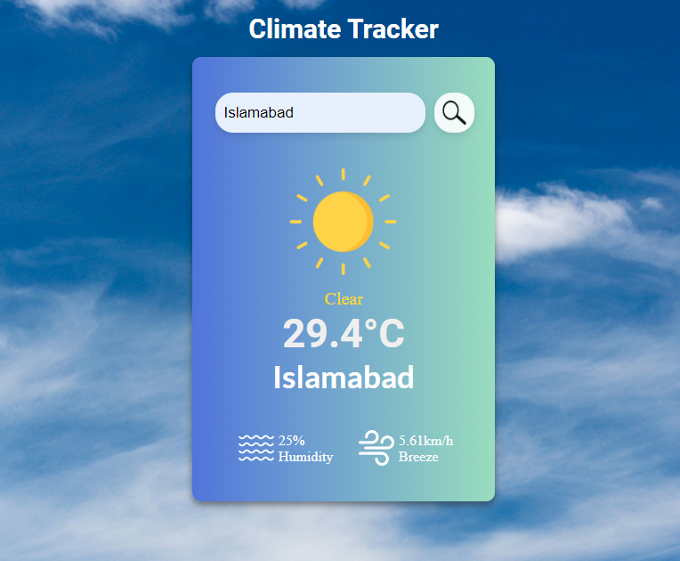

# ClimateTracker

Climate Tracker is a web application designed to provide users with real-time weather information for locations worldwide. It utilizes HTML, CSS, JavaScript, and API integration to fetch and display weather data.

## Features
<ul>
    <li><b>Real-time Weather Data:</b> Fetches weather data from a third-party API to provide users with up-to-date weather information.</li>
    <li><b>Location-based:</b>Users can search for weather information for any location worldwide.</li>
</ul>

## Technologies Used
<ul>
    <li><b>HTML: </b> For structuring the web page.</li>
    <li><b>CSS:</b>For styling the web page and making it visually appealing.</li>
    <li><b>JavaScript: </b>For implementing interactive features and handling API requests.</li>
    <li><b>API Integration: </b>Utilizes a weather API to fetch weather data.</li>
</ul>

## Screenshot

## API Integration

This application integrates with a weather API to fetch weather data. You will need to sign up for an API key and replace the placeholder API key in the JavaScript code with your actual API key. You can obtain an API key by signing up on the weather API provider's website.

### Credits

Weather data provided by
<a href="https://openweathermap.org/api">Weather API</a>

